StockFlow v1.0 — Inventory Management System

Modern Laravel Inventory Management System with clean architecture and responsive dashboard UI.

Available on Gumroad
https://guunawan.gumroad.com/l/stockflow-v1

Available on Lynk
https://lynk.id/guunawan/e51ndox3ykzg

Store: https://lynk.id/guunawan


Clean and modern inventory management system built with Laravel and Sneat Admin Dashboard.

⸻

# Overview

StockFlow is a modern inventory management system built with Laravel and the Sneat Admin Dashboard template.

This application helps manage products, categories, stock movement, and inventory transactions through a clean, responsive, and user-friendly interface.

⸻

# Live Preview

Project walkthrough and feature demonstration:

https://youtu.be/g1ZKtKG0LsI?si=GmdtLBfJg6HqEaCv

⸻

# Main Features

* Dashboard overview
* Product management
* Category management
* Stock in & stock out system
* Inventory transaction history
* Stock alert notifications
* Responsive sidebar and mobile layout
* Clean architecture structure
* Reusable Blade components
* Pagination, filtering, and sorting

⸻

# Screenshots

## Dashboard

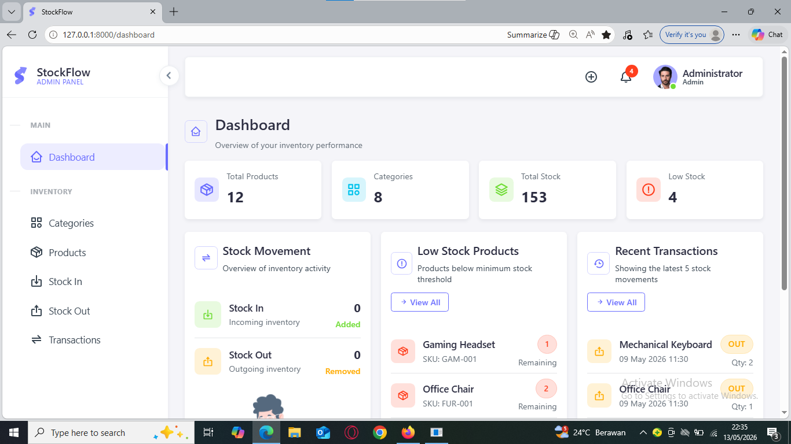
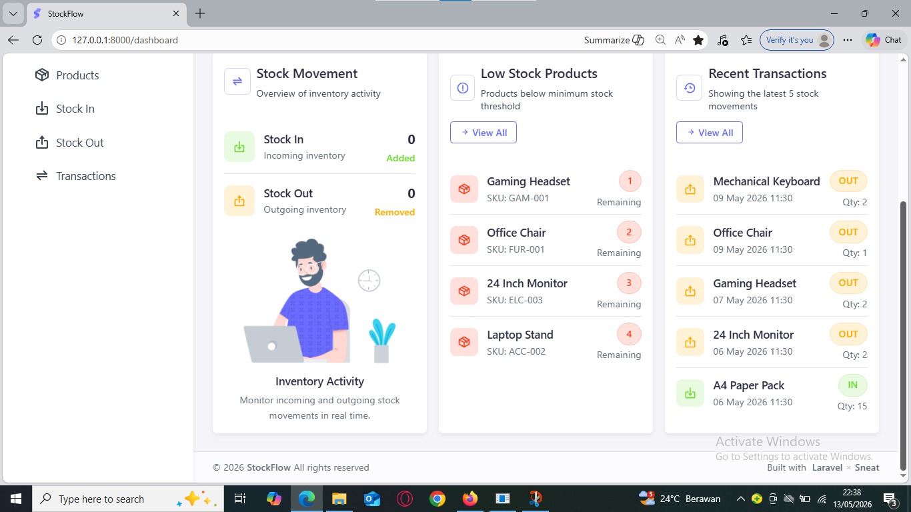

⸻

## Responsive Layout

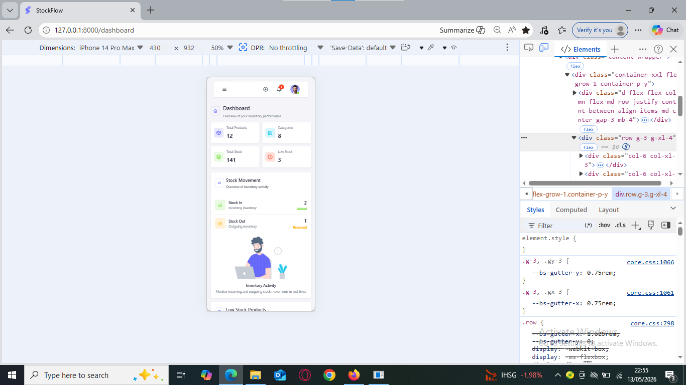
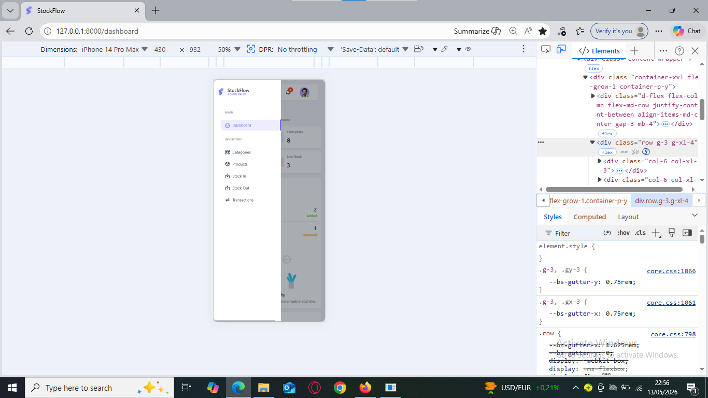

⸻

## Products

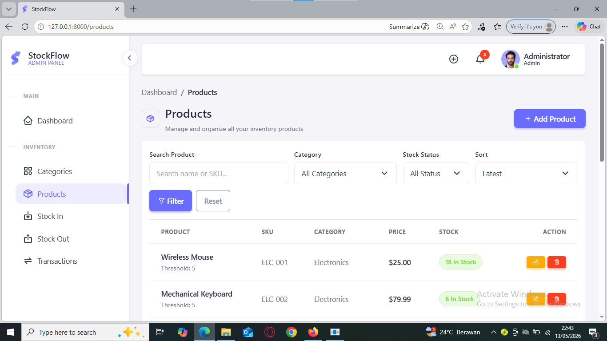
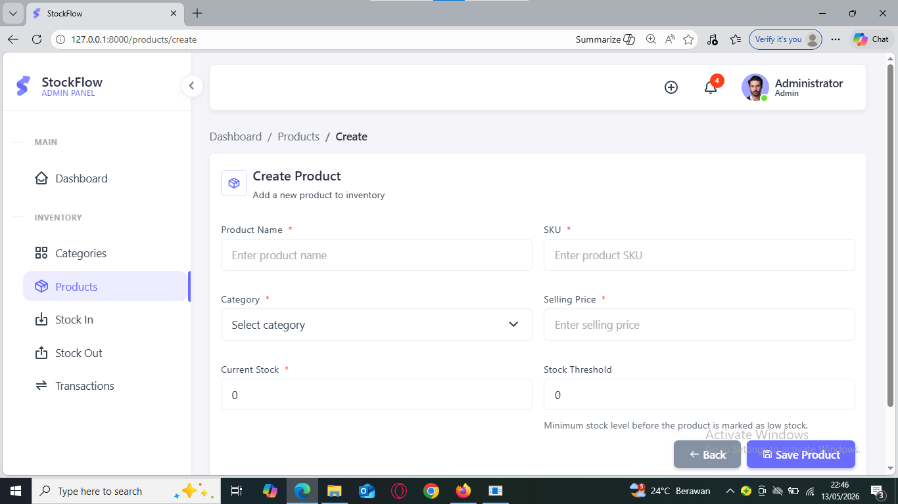
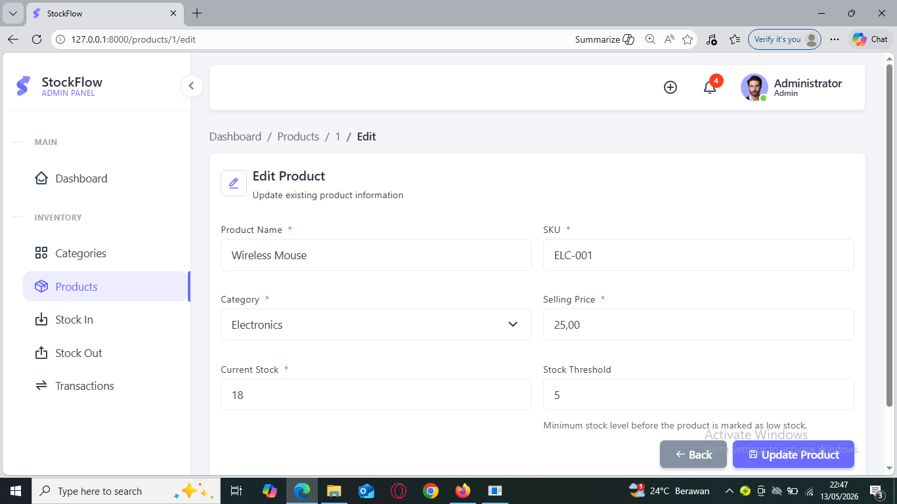
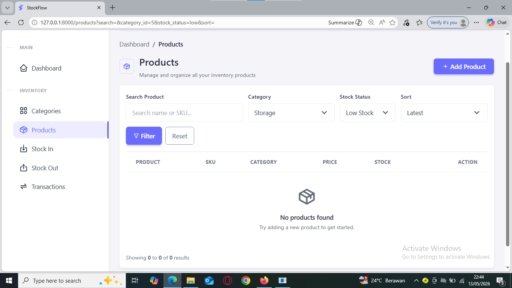

⸻

## Categories

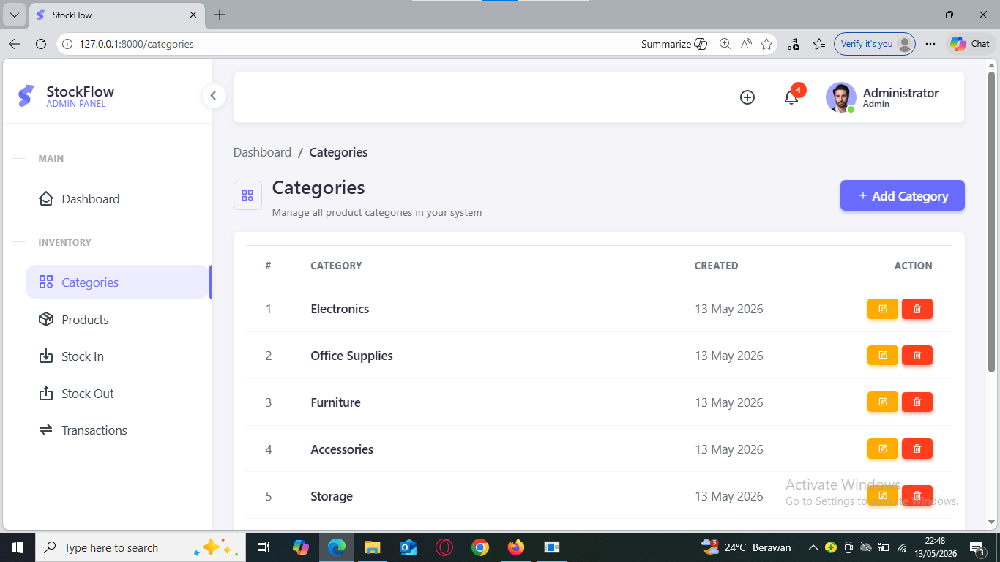

⸻

## Transactions

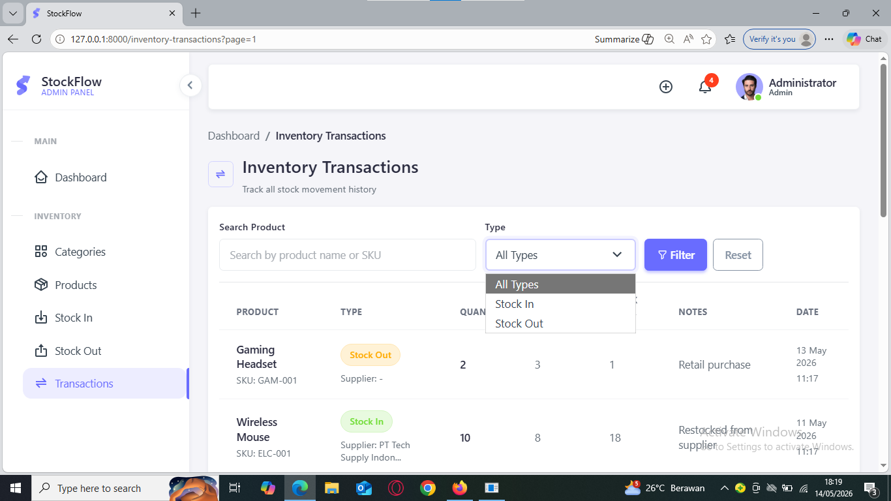
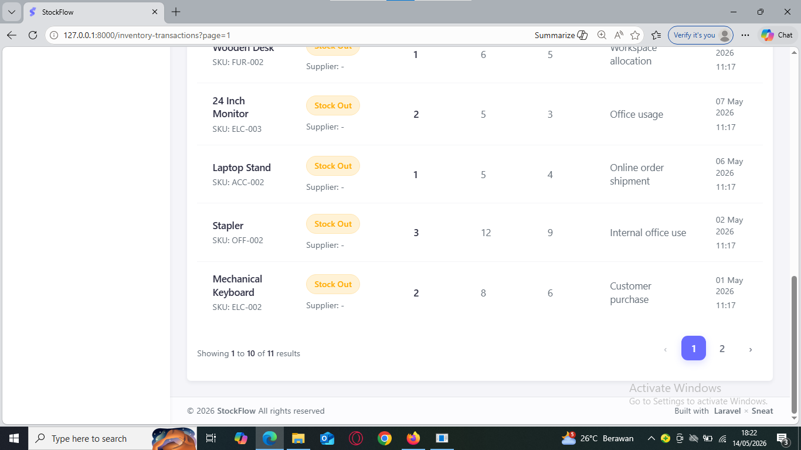

⸻

# Technology Stack

* Laravel 12
* Bootstrap 5
* Sneat Admin Dashboard
* jQuery

⸻

# Included in Package

* Full source code
* Database migrations
* Seeder with demo data
* Documentation

⸻

# Demo Accounts

## Verified Account

Email: admin@example.com
Password: password

## Unverified Account

Email: demo@example.com
Password: password

⸻

# Requirements

* PHP >= 8.2
* Composer >= 2.x
* Laravel 12.x
* MariaDB >= 10.4
* Apache >= 2.4 or Nginx

## Tested On

* PHP 8.2.12
* Composer 2.9.3
* Laravel 12.12.2
* MariaDB 10.4.32

⸻

# Installation Guide

1. Extract the downloaded ZIP file

Open the project folder in terminal or command prompt.

⸻

2. Install dependencies
```bash
composer install
```
⸻

3. Create environment file
```powershell
Copy-Item .env.example .env
```
⸻

4. Generate application key
```bash
php artisan key:generate
```
⸻

5. Configure database

Update your database credentials inside the .env file.

⸻

6. Clear cache
```bash
php artisan optimize:clear
```
⸻

7. Run migration and seed demo data
```bash
php artisan migrate --seed
```
⸻

8. Start development server
```bash
php artisan serve
```
⸻

9. Open in browser
```txt
http://127.0.0.1:8000
```
⸻

# Notes

This item is built with Laravel 12 and Sneat Admin Dashboard template.

The project includes:

* Responsive layout
* Demo accounts
* Seeder data
* Documentation
* Clean project structure

All required assets are included except the vendor directory.

⸻

# Tags

inventory management, laravel, stock management, admin dashboard, bootstrap, sneat, inventory system, product management, warehouse management, responsive dashboard, stock tracking, crud application, laravel 12, bootstrap 5, inventory tracker
